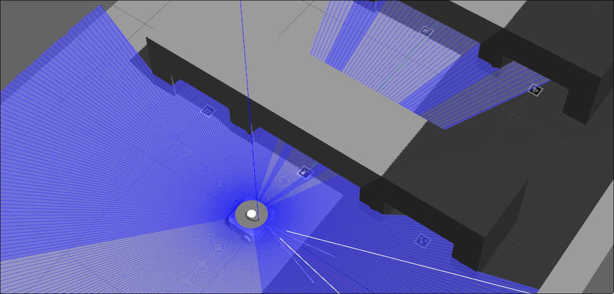

# Warehouse Tasker



A repo for the warehouse task allocation system for a fleet of turtlebots.

## Dependencies
To properly run this, there a number of dependencies that must be installed first,

The [turtlebot3_multi_robot](https://github.com/arshadlab/turtlebot3_multi_robot) package from ashadlab and [ros_aruco_opencv](https://github.com/fictionlab/ros_aruco_opencv/tree/humble) package from fictionlab needs to be installed with the following,

```bash
cd ~/<your ros2_ws here>/src
git clone -b master https://github.com/arshadlab/turtlebot3_multi_robot.git
git clone -b humble git@github.com:fictionlab/ros_aruco_opencv.git
```
Install any dependencies for these packages with the following,

```bash
cd ..
source /opt/ros/humble/setup.bash
rosdep install --from-paths src -r -y
```

Next, build the package with a symlink and source them,

```bash
colcon build --symlink-install
source ./install/setup.bash
```

Now the workspace is ready to install the warehouse_tasker package.

## How to install

First clone this repo through SSH into your ros2 workspace,

```bash
cd ~/<your ros2_ws here>/src
git clone git@github.com:imJohly/warehouse_tasker.git
```

Then build it using colcon and source it from the install directory,

```bash
cd ..
colcon build --packages-select warehouse_tasker --symlink-install
source install/local_setup.bash
```

It should have built successfully, but lets test it.

## Launching the test environment

To launch the test environment,

```bash
ros2 launch warehouse_tasker world.launch.py
```

For multi robots,

```bash
ros2 launch warehouse_tasker world_triple_robot.launch.py
```
