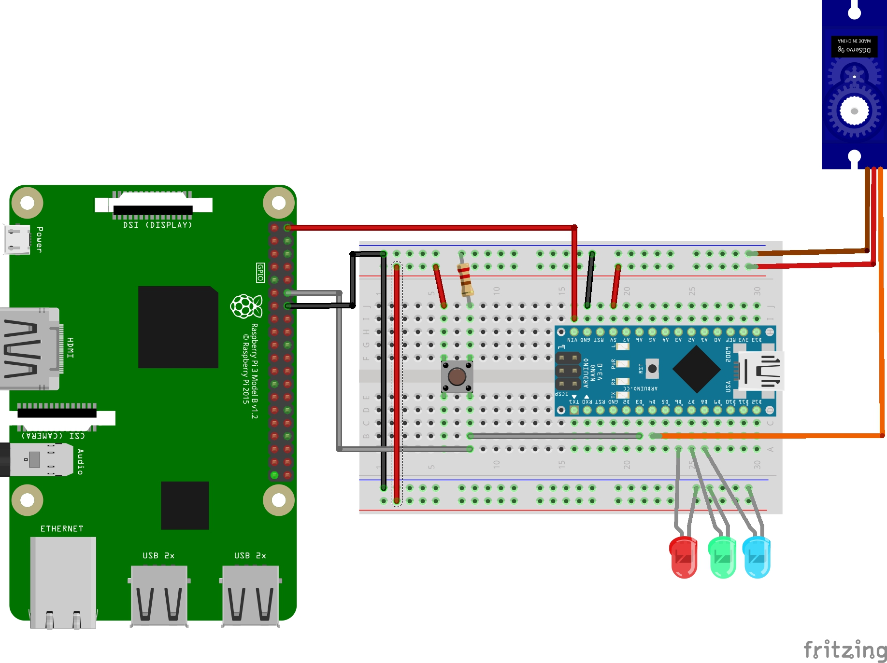

# Payload Mechanism and wiring Diagram for Warehouse Robot

## Hardware
There are two parts of hardware. The electircal and the mechanical.

The mechanical is all 3d printed and the step files are located in the Step Files folder under the payload branch. 

For the mechanical/3d prints you will need:
    - 1x box
    - 1x Door_full OR Door_Quick
    - 1x Gear
    - 2x Pole

For the electical you will need:
    - 1x continous 9g servo
    - 1x arduino nano
    recomended
    - 1x resistor
    - 3x led (varing colours)
    - 1x button

### Software

The software is located in the Ardunio Code folder.

It is basic code that activates the servo controlling the door for a set time when a high signal from either the button or the rasberry Pi is recieved.