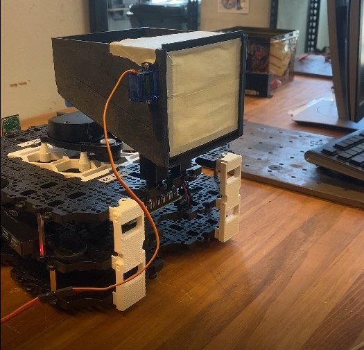
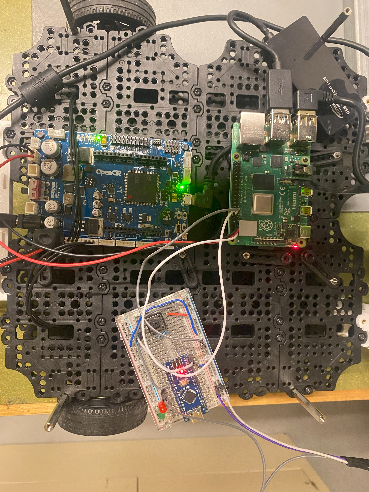

# Payload Mechanism and Wiring Diagram for Warehouse Robot

## Hardware
There are two parts of hardware: the electrical and the mechanical.

The mechanical components are all 3D printed, and the STEP files are located in the "Step Files" folder under the payload branch.

For the mechanical/3D prints you will need:
- 1x box
- 1x Door_full OR Door_Quick
- 1x Gear
- 2x Pole

For the electrical you will need:
- 1x continuous 9g servo
- 1x Arduino Nano
Recommended:
- 1x resistor
- 3x LED (varying colors)
- 1x button

See the schematic diagram below for wiring.

See our wiring in the image below.

### Software

There are two parts to the software. The arduino code which runs the payload mechanism and the code on the turtlebot that controls the GPOI pins of the rasberry pi that tells the arduino when to run.

The Arduino software is located in the "Arduino Code" folder.

It is code that activates the servo controlling the door for a set time when a high signal from either the button or the Raspberry Pi is received.

The other code is in the unloader branch of this git repo and is split up into two files. The unloader_node.py and the launch file unloader.launch.py.

## Unloader Node (unloader_node.py)
This file defines a ROS 2 node running on the TurtleBot, which controls the GPIO pins and provides a service to open a door.

- Functionality:
    - The node is responsible for controlling a specific GPIO pin (pin 18).
    - It provides a ROS 2 service named open_door. When this service is called, the node will activate the GPIO pin to open the door.
    - The GPIO pin is set high for a short duration (1 second), then set low to complete the action.

## Launch File (unloader.launch.py)
This file is used to start the unloader_node and configure it to run within the ROS 2 environment.

- Functionality:
    - The launch file starts the unloader_node on the TurtleBot.
    - It allows the unloader node to be controlled externally, enabling interaction from an external computer or other ROS 2 nodes in the network.

